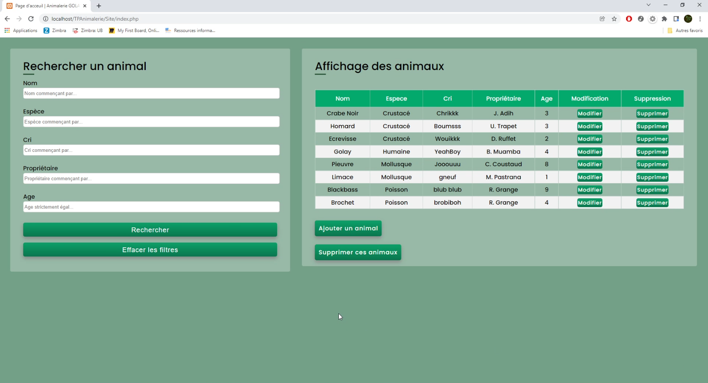
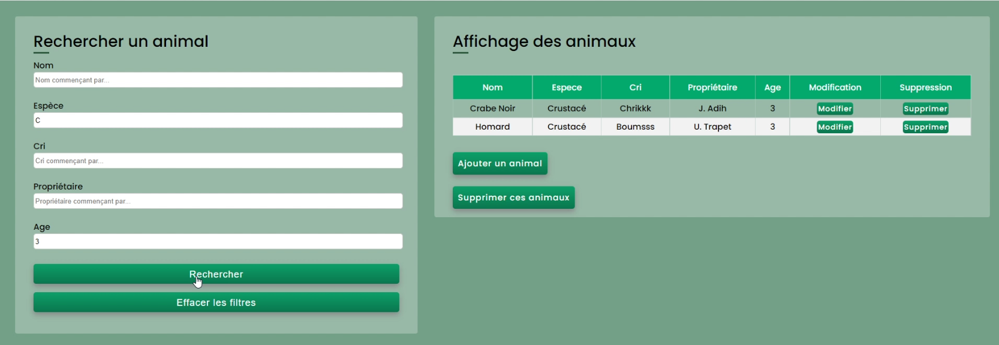
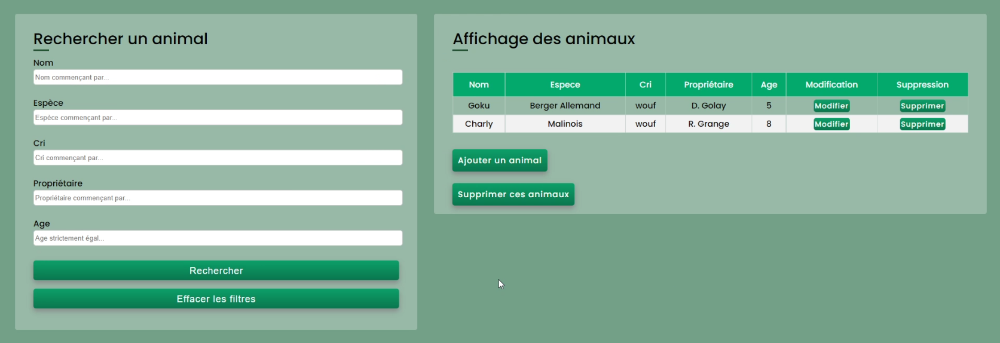

# :question: Le projet en quelques points :question:
<i> Ce projet a été réalisé dans le cadre d'un TP de 2ème d'IUT informatique en une vingtaine d'heures (noté 20/20).  
  Il sagit d'un site permettant de gérer les animaux (criant) d'une animalerie fictive. </i>  
  :bulb: Les principales fonctionnalités étant <b> l'ajout, la suppression, la modification, la recherche et le listage </b> d'instances "d'animaux" (relié à une Database).  

## 📜 Classes et scripts PHP
•	Classe utilitaire pour générer du contenu HTML, attributs, identifiant  
•	Classe IHM pour regénérer facilement le tableau des animaux
•	Formulaires dynamiques (décorés différemment selon les cas)

## 🔍 Recherche par filtre
•	Possibilité de trouver plusieurs animaux qui correspondent aux critères de recherche  
•	Recherche par filtres cumulés (les champs de recherche ne sont pas obligatoires, il permette d’affiner la recherche).  
•	Recherche flexible qui permet d’afficher les animaux dont le nom, l’espèce etc. commence par le contenu entré dans le formulaire  
•	Recherche stricte de l’âge (seuls les âges équivalent sont trouvables)  
•	Possibilité de supprimer tous les animaux (filtrés) d’un coup.  

## 🛡️ Sécurité et confort
•	Gestion des caractère spéciaux pour éviter les injection SQL  
•	Redirection vers l’index   
•	Gestion des exceptions de PDO  
•	Vérification des champs qui doivent être non vide  
•	Page intermédiaire de suppression des animaux  

## 🖼️ Quelques Captures d'ecran

<h3> 📄 Page de gestion complete</h3>

    

<h3> 📄 Recherche avec deux fitres "commençant par" </h3>

    

<h3> 📄 Suppression d'une recherche filtrée </h3>

    

<h3> 📄 Ajout d'un nouvel animal </h3>

    

<h3> 📄 Modification d'un animal </h3>

    

